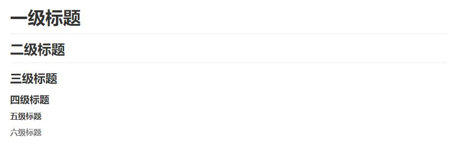

###	Markdown笔记

##	1.标题
> 作用：# 的数目多少表示字体级别大小  
> 用法：# 号放在字体的前面，并加上一个tab键或空格(方法之一)  

	# 一级标题
	## 二级标题
	### 三级标题
	#### 四级标题
	##### 五级标题
	###### 六级标题

<!--  -->

<!--  -->

> 作用：===和- - -分别表示字体的级别大小  
> 用法：将===和- - -放在所需文字下一行(方法之二)  

	一级标题
	===
	二级标题
	- - -

<!--  -->

## 2.分割线
> 作用：分割，使页面更清晰  
> 方法：三个以上的 - 或 * 表示，且一行只有这一个符合，中间可以用空格隔开  

	--- 分割线
	*** 分割线  

<!--  -->

## 3.段落
> 作用：分块并且正确显示内容  
> 方法：段落结束后，在其后面加上两个空格(或段落结束后空一行)

	第一段  (空格空格)
	第二段
	第一段(空一行)

	第二段  

<!--  -->

## 4.字体
> 作用：字体倾斜、加粗  
> 方法：在待加粗字体前后加上 * 或 _ 一对显示斜体；两对显示加粗；三队显示斜体加粗

	*斜体*
	_斜体_
	**加粗**
	__加粗__
	***斜体加粗***
	___斜体加粗___

## 5.删除线
> 作用：在段落文字上显示删除线
> 方法：在段落文字两边加上两个波浪线 ~~ 

	这是一段话
	~~这是一段话~~

## 6.下划线
> 作用：在段落文字下面显示下划线  
> 方法：可以使用html语言里的<u>段落</u>，在段落分别加上<u>xx</u>  

	这是一段话
	<u>这是一段话</u>

## 7.脚注
> 作用：对文字的补充说明  
> 方法：在需要加脚注的文字后面加上[ ^XX ]，在某行加上[ ^XX ]:对文字的解释（一般放在页面最下面）

	这是一段话
	这是一段话[^待解释]
	[^待解释]:对这段话的解释说明

